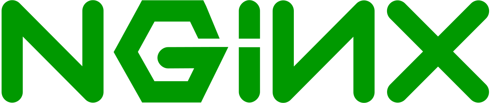

<h1 align="left" id="philipmutua-title">:wave: Hello there! I'm Philip Mutua</h1>
<h3 align="left">I work on web applications and web infrastructure</h3>

  
  
  

- :office: &nbsp;I'm currently working at **[Nouveta]**
- :seedling: &nbsp;I’m currently learning **Go**
- :speech_balloon: &nbsp;I like to talk about **Anything Tech** and **life**
- :mailbox: &nbsp;Ask me anything on my **[Issues_Page]**
- :computer: &nbsp;Connect with me on **[LinkedIn]**

 

<h2 align="left" id="philipmutua-tech">Favorite Tech</h2>

> Tools, languages, and other things that I like to work with.

<table>
  <tr>
    <td align="center" width="96">
      
       Python&nbsp;(Core)
    </td>
    <td align="center" width="96">
      
       Django
    </td>
    <td align="center" width="96">
      
       Angular
    </td>
    <td align="center" width="96">
      
       Jsonnet
    </td>
    <td align="center" width="96">
      
       TypeScript
    </td>
    <td align="center" width="96">
      
       JavaScript
    </td>
    <td align="center" width="96">
      
       NGINX
    </td>
    <td align="center" width="96">
      
       Bootstrap
    </td>
    <td align="center" width="96">
      
       Sass
    </td>
  </tr>
  <tr>
    <td align="center" width="96"> 
      
       Docker
    </td>

    <td align="center"  width="96">
      
       Debian
    </td>
    <td align="center"  width="96">
      
       RHEL
    </td>
    <td align="center" width="96">
      
       Powershell
    </td>
    <td align="center"  width="96">
      
       MySQL
    </td>

  </tr>
</table>

<h2 align="left">Languages</h2>

> I mostly use the following languages everyday [(Learn how this works)](https://wakatime.com)

<!-- prettier-ignore-start -->
<!-- START_SECTION Chart-->

<figure></img></figure>

<!-- END_SECTION: Chart-->

<!-- links -->

[Nouveta]: https://github.com/NouvetaLimited "Nouveta Github Home"
[Issues_Page]: https://github.com/pmutua/pmutua/issues "pmutua/issues"
[Linkedin]: https://www.linkedin.com/in/pmutua "Philip Mutua LinkedIn"
